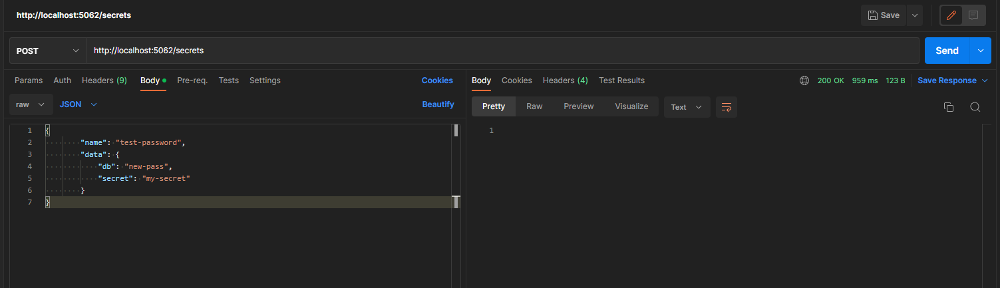
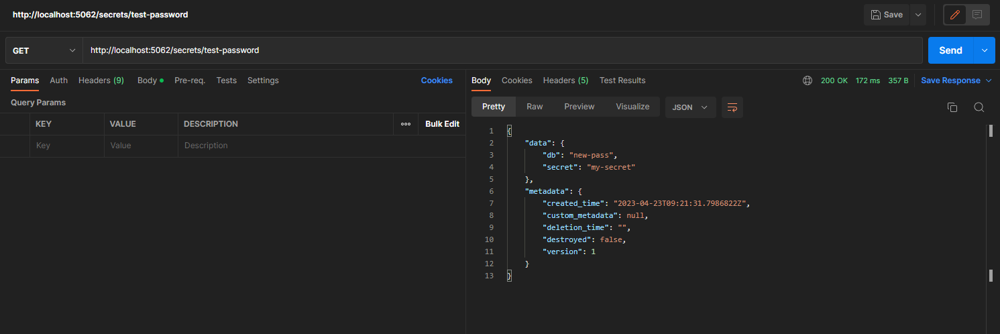
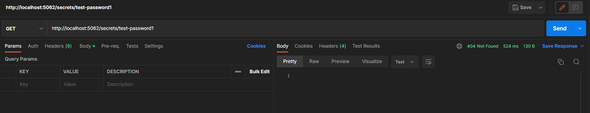

# Vault Example in C#

## Prerequisite

1. .NET 8 or newer

## Projects

1. [Web API](VaultExampleAPI)

## Build Project

`dotnet build`

## Run Project

### Web API

`dotnet run VaultExampleAPI`

## Testing (End to End)

### Write

### Read (Exists)

### Read (Not Exists)

